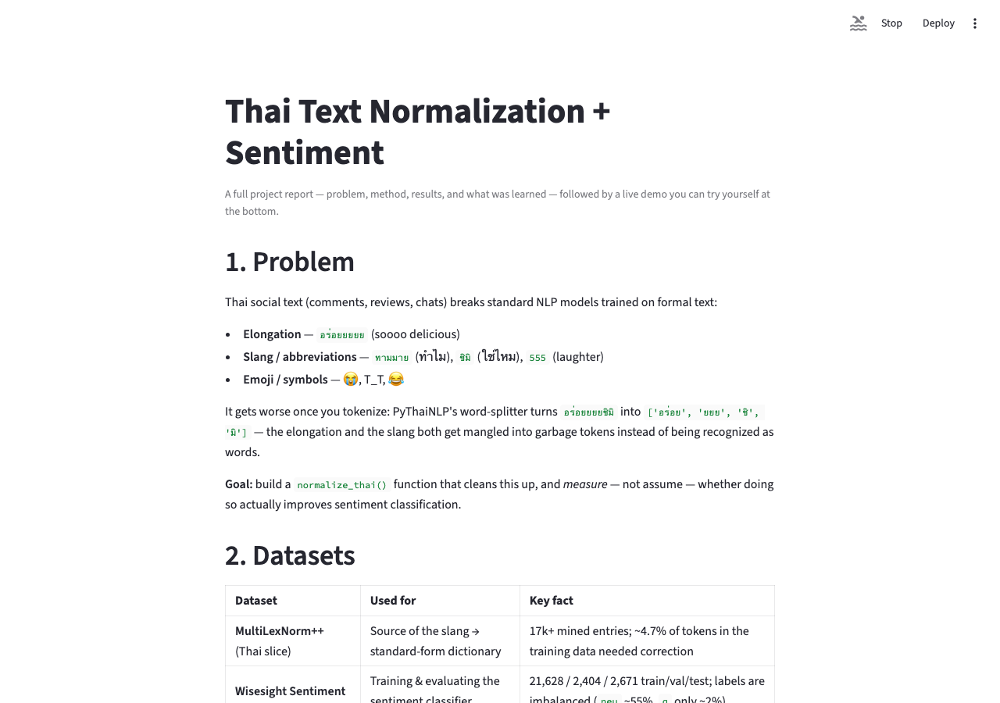
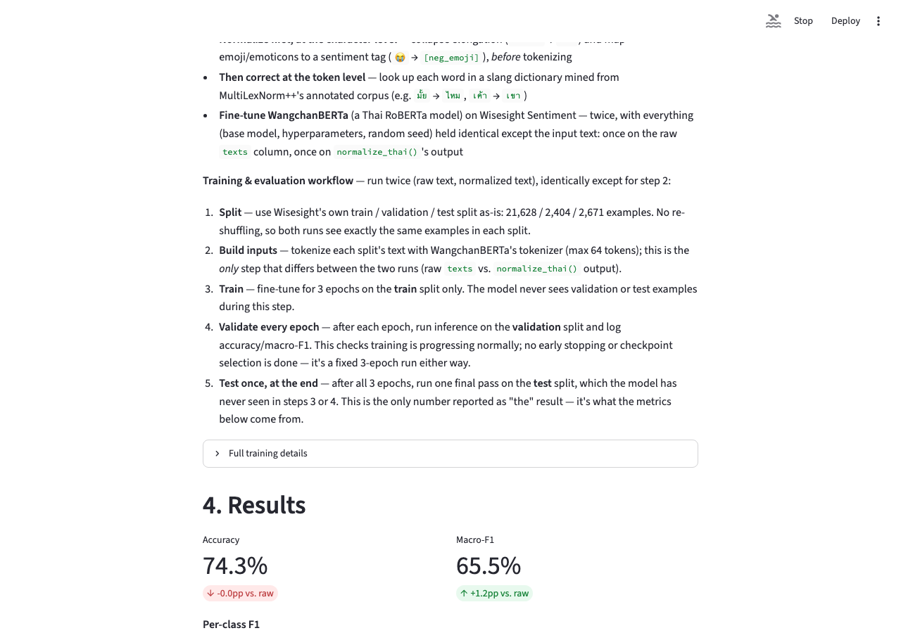
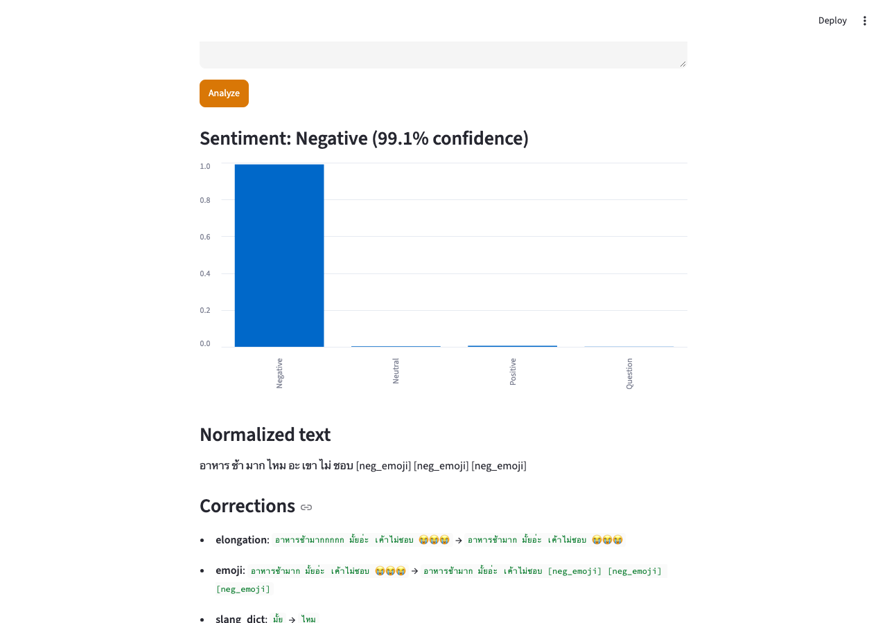
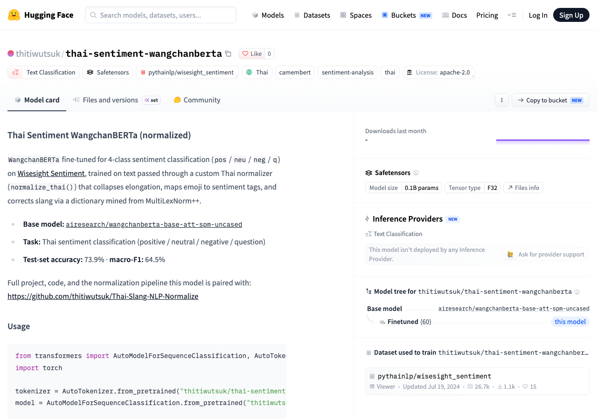

# Thai Text Normalization


Normalizes informal Thai social text (elongation, slang, emoji) into a standard form, to measure how much it improves downstream sentiment classification accuracy.

**Live demo:** deploy `streamlit_app.py` to [Streamlit Community Cloud](https://share.streamlit.io) and update this link · **Model:** [thitiwutsuk/thai-sentiment-wangchanberta](https://huggingface.co/thitiwutsuk/thai-sentiment-wangchanberta) on the Hugging Face Hub

## Preview

<table>
<tr>
<td width="50%"></td>
<td width="50%"></td>
</tr>
<tr>
<td width="50%"></td>
<td width="50%"></td>
</tr>
</table>

## Contents

- [Preview](#preview)
- [Problem](#problem)
- [Pipeline](#pipeline)
- [Methodology](#methodology)
- [Normalization Core](#normalization-core)
- [Datasets](#datasets)
- [Results](#results)
- [Module Reference](#module-reference)
- [Project Structure](#project-structure)
- [Setup](#setup)
- [Usage](#usage)
- [Roadmap](#roadmap)

## Problem

- Thai social text (comments, reviews, chats) breaks standard NLP models trained on formal text
  - Elongation: `อร่อยยยยย` (soooo delicious)
  - Slang/abbreviations: `ทามมาย` (ทำไม), `ชิมิ` (ใช่ไหม), `555` (laughter)
  - Emoji/symbols: 😭, T_T, 😂
- Tokenizers make it worse: `word_tokenize("อร่อยยยยชิมิ")` splits into `['อร่อย', 'ยยย', 'ชิ', 'มิ']` — elongation has to be fixed *before* tokenizing, not after
- **Goal:** build `normalize_thai()` and prove it raises sentiment-classification accuracy vs. raw text

## Pipeline

- **Clean** ([src/cleaning.py](src/cleaning.py)) — strip URLs, mentions, hashtag symbols, extra whitespace
- **Reduce elongation** ([src/elongation.py](src/elongation.py)) — collapse repeated characters, character-level, before tokenizing
- **Map emoji/emoticons** ([src/emoji_map.py](src/emoji_map.py)) — emoji/text-emoticons → sentiment tokens
- **Tokenize** ([src/tokenization.py](src/tokenization.py)) — PyThaiNLP `word_tokenize` (`newmm` engine)
- **Slang lookup** ([src/slang_dict.py](src/slang_dict.py)) — per-token dictionary correction, sourced from MultiLexNorm++
- **Classify** ([scripts/train_sentiment.py](scripts/train_sentiment.py)) — fine-tune WangchanBERTa on Wisesight Sentiment, raw vs. normalized text
- **Evaluate** ([scripts/evaluate_results.py](scripts/evaluate_results.py)) — compare accuracy/F1/confusion matrices, curate cases normalization fixed
- **Demo** *(planned)* — Gradio app deployed to Hugging Face Spaces

## Methodology

- **Normalization is rule + dictionary based, not learned** — deterministic and identical regardless of downstream task
  - Runs **character-level fixes first** (elongation, emoji/emoticons), *before* tokenizing — PyThaiNLP's tokenizer mis-segments elongated/slang input (`"อร่อยยยยชิมิ"` → `['อร่อย', 'ยยย', 'ชิ', 'มิ']`), so fixing characters after tokenizing would be too late
  - Runs **token-level correction second** (slang dictionary lookup) on the already-tokenized, already-cleaned text
  - The slang dictionary itself is majority-vote statistics mined from MultiLexNorm++'s annotated corpus (17k+ entries), filtered to entries seen ≥3 times to drop one-off noise
- **Sentiment classification is transfer learning, not training from scratch**
  - Base model: `airesearch/wangchanberta-base-att-spm-uncased` (a RoBERTa-family model pretrained on Thai text)
  - A new classification head (`AutoModelForSequenceClassification`, 4 labels) is bolted on top with randomly-initialized weights and trained from there
  - Loss: cross-entropy · Optimizer: AdamW · LR: 5e-5 with linear decay, no warmup
  - 3 epochs, batch size 32, max sequence length 64 tokens; evaluated on the validation split at the end of every epoch
- **The raw-vs-normalized comparison is a controlled experiment** — exactly one variable changes between the two training runs
  - Same base model, same hyperparameters, same random seed (42), same train/validation/test split
  - `raw` run trains on the dataset's `texts` column unmodified
  - `normalized` run trains on `normalize_thai(text)["normalized_text"]` instead — nothing else in the training loop differs
  - Any accuracy/F1 delta between the two runs can therefore be attributed to normalization itself, not to incidental setup differences
- **Evaluation is done once, on held-out data** — final metrics come from the **test** split, which the model never sees during training or epoch-by-epoch validation
  - Reports **macro-F1 alongside accuracy**, since Wisesight's labels are imbalanced (`neu` ~55% vs. `q` ~2%) and accuracy alone would hide how badly the minority classes are doing

## Normalization Core

`normalize_thai(text)` ([src/normalize.py](src/normalize.py)) runs the steps above in order and returns a dict:

```python
>>> normalize_thai("อาหารช้ามากกกกก มั้ยอ่ะ เค้าไม่ชอบ 😭😭😭")
{
  "text": "อาหารช้ามากกกกก มั้ยอ่ะ เค้าไม่ชอบ 😭😭😭",
  "normalized_text": "อาหาร ช้า มาก ไหม อะ เขา ไม่ ชอบ [neg_emoji] [neg_emoji] [neg_emoji]",
  "tokens": ["อาหาร", "ช้า", "มาก", "ไหม", "อะ", "เขา", "ไม่", "ชอบ", "[neg_emoji]", ...],
  "corrections": [
    {"original": "...มากกกกก...", "normalized": "...มาก...", "type": "elongation"},
    {"original": "...😭😭😭",      "normalized": "...[neg_emoji]...", "type": "emoji"},
    {"original": "มั้ย", "normalized": "ไหม", "type": "slang_dict"},
    {"original": "อ่ะ",  "normalized": "อะ",  "type": "slang_dict"},
    {"original": "เค้า", "normalized": "เขา", "type": "slang_dict"}
  ]
}
```

<details>
<summary>Design notes / known gaps</summary>

- Elongation reduction skips digit runs (`555` = laughter, not a typo) and emoji runs — only collapses letters/punctuation
- The slang dictionary only corrects entries seen ≥3 times in MultiLexNorm++'s training data (17k+ entries) — coverage gaps remain (e.g. `ชิมิ` isn't in it, so it still gets mis-tokenized)
- The dictionary also requires a **strict majority** (>50% of annotations), not just a plurality — some source entries record their "norm" from a 3-way split or an exact tie (e.g. `โมง`, a normal word for "o'clock", was tied 7/14 between "keep" and "delete," and originally defaulted to deleting it). Found while building the demo; **fixed after** the Phase 3/4 benchmark numbers above were computed, so a from-scratch rerun would likely shift them slightly (in normalization's favor, since it removes corruption of valid words)
- Emoji/text-emoticons map to one of 3 tags: `[pos_emoji]`, `[neg_emoji]`, `[emoji]` (unrecognized) — a coarse sentiment signal, not per-emotion granularity

</details>

## Datasets

| Dataset | Purpose | Notes |
|---|---|---|
| [`hadung1802/mlnorm-resources`](https://huggingface.co/datasets/hadung1802/mlnorm-resources) | Slang/lexical normalization pairs (Thai) | Not a standard `load_dataset` repo — copied locally to [data/raw/mlnorm/](data/raw/mlnorm/) by `scripts/fetch_data.py`
| [`pythainlp/wisesight_sentiment`](https://huggingface.co/datasets/pythainlp/wisesight_sentiment) | Sentiment labels (pos/neu/neg/q) | Primary dataset for measuring accuracy before/after normalization — copied locally to [data/raw/wisesight/](data/raw/wisesight/)
| [`Wongnai/wongnai_reviews`](https://huggingface.co/datasets/Wongnai/wongnai_reviews) | Rating classification (1–5 stars) | Not used — reviews are long-form (~550 chars avg) and skew to 3–4 stars, outside this project's short-text scope

<details>
<summary>Known dataset quirks (see <code>scripts/explore_datasets.py</code>)</summary>

- MultiLexNorm++ `test.norm` is a **blind test set** (labels blanked, 0/34,167 non-empty) — use `dev.norm` for evaluation instead
- MultiLexNorm++ `train.norm`/`dev.norm` correct ~4.7% of tokens each — mostly elongation, spacing (`ๆ`), and informal spellings (`เค้า`→`เขา`, `มั้ย`→`ไหม`)
- Wisesight labels are imbalanced (`neu` ~55%, `neg` ~25%, `pos` ~18%, `q` ~2%) — report macro-F1, not just accuracy
- Wongnai ratings skew heavily to 3–4 stars (train: 1★=415 vs. 4★=18,770) — would need bucketing into neg/neu/pos if ever used

</details>

## Results

Phase 3/4 fine-tunes `airesearch/wangchanberta-base-att-spm-uncased` on Wisesight Sentiment (3 epochs, batch 32, max length 64), once on raw text and once on `normalize_thai()` output, with everything else held constant — isolating normalization as the only variable.

| Setup | Accuracy | Macro-F1 | pos F1 | neu F1 | neg F1 | q F1 |
|---|---|---|---|---|---|---|
| Raw text | 74.35% | 64.28% | 49.7% | 79.4% | 79.0% | 49.0% |
| Normalized text | 74.32% | **65.51%** | **52.9%** | 79.0% | 79.2% | **50.9%** |

**Takeaway:** accuracy barely moves (dominated by the majority `neu`/`neg` classes, which don't need normalization to be classified well), but **macro-F1 improves by +1.2pp**, driven almost entirely by the minority classes — `pos` +3.2pp, `q` +1.9pp.

- On the 2,671-example test set, normalization **flips 174 predictions wrong→correct and 175 correct→wrong** — almost a wash at the instance level, which is *why* accuracy barely moves
- But those two sets of flips aren't evenly spread across classes: the fixes disproportionately land on the minority classes (`pos`/`q`), while the regressions disproportionately land on classes (`neu`/`neg`) that had plenty of correct predictions to spare — a redistribution that improves macro-F1 (an unweighted per-class average) without changing raw accuracy much
- Of the 174 fixes, only 116 came from an actual `normalize_thai()` correction (elongation/emoji/slang) — the other 58 had **zero logged corrections**, meaning the fix came purely from PyThaiNLP's word segmentation giving WangchanBERTa's own subword tokenizer better boundaries to work with, not from the dictionary/elongation logic itself

<details>
<summary>Why q/pos lag behind neu/neg in absolute terms</summary>

Wisesight's label distribution is skewed (`neu` 55%, `q` only 2% of training data), so the minority classes get far fewer training examples — expected under plain cross-entropy training with no class weighting. This affects both the raw and normalized runs, so the *relative* raw-vs-normalized comparison stays valid even though absolute per-class numbers are uneven.

</details>

Full comparison table, confusion matrices, fixed/broken examples, and documented limitations: [results/phase4_report.md](results/phase4_report.md) (generated by `python -m scripts.evaluate_results`).

## Module Reference

| Module | Responsibility |
|---|---|
| [src/cleaning.py](src/cleaning.py) | Strip URLs/mentions/hashtag symbols, collapse whitespace |
| [src/elongation.py](src/elongation.py) | Collapse repeated characters (`มากกกกก` → `มาก`) |
| [src/emoji_map.py](src/emoji_map.py) | Emoji + text-emoticons → `[pos_emoji]`/`[neg_emoji]`/`[emoji]` |
| [src/tokenization.py](src/tokenization.py) | PyThaiNLP word tokenization |
| [src/slang_dict.py](src/slang_dict.py) | Token-level slang → standard-form lookup (MultiLexNorm++) |
| [src/normalize.py](src/normalize.py) | Combines all of the above into `normalize_thai()` |

## Project Structure

```
src/                reusable normalize_thai() pipeline code
scripts/            data-fetching, exploration, training, and evaluation scripts
tests/              pytest unit tests (one file per src/ module)
data/raw/           raw dataset files, fetched via scripts/fetch_data.py (git-tracked)
results/            saved metrics, predictions, and training logs (git-tracked)
models/             local model checkpoints (gitignored — retrain to regenerate)
notebooks/          project_report.ipynb, a fully-executed narrative report
docs/screenshots/   README preview images
deploy/             Space/model-card metadata for deployment
app.py              Gradio demo (local only — Spaces now requires a PRO plan for Gradio/Docker)
streamlit_app.py    Streamlit demo + on-page report (deployable on Streamlit Community Cloud, free)
thai-text-normalization-plan-en.md   full project plan & milestones
```

## Setup

```bash
python3.11 -m venv .venv
source .venv/bin/activate
pip install -r requirements.txt
python -m scripts.fetch_data   # copies the raw dataset files into data/raw/
```

## Usage

- Fetch raw dataset files into `data/raw/` (run once after setup)
  ```bash
  python -m scripts.fetch_data
  ```
- Explore dataset structure
  ```bash
  python scripts/explore_datasets.py
  ```
- Run the Phase 1 cleaning + tokenization demo on real Wisesight samples
  ```bash
  python -m scripts.phase1_demo
  ```
- Fine-tune WangchanBERTa on raw or normalized text
  ```bash
  python -m scripts.train_sentiment --variant raw
  python -m scripts.train_sentiment --variant normalized
  ```
  - `--limit N` truncates each split, for a fast smoke test before a full run
  - On Apple Silicon, set `PYTORCH_ENABLE_MPS_FALLBACK=1` — some ops can otherwise stall on the MPS backend
- Compare raw vs. normalized results once both have run
  ```bash
  python -m scripts.evaluate_results
  ```
- Run the test suite
  ```bash
  python -m pytest -q
  ```
- Run the Gradio demo locally (needs a saved model first — see below)
  ```bash
  python -m scripts.train_sentiment --variant normalized --save-model-dir models/wangchanberta-normalized
  python app.py
  ```
  - Not deployable to Hugging Face Spaces for free as of this project — HF now requires a PRO
    subscription to host Gradio/Docker Spaces (only static, no-backend Spaces are free)
- Run the Streamlit demo (report + live demo on one page)
  ```bash
  streamlit run streamlit_app.py
  ```
  - Loads its model straight from the Hugging Face Hub (`thitiwutsuk/thai-sentiment-wangchanberta`,
    a free model repo, not a Space) — no local checkpoint needed
  - Deployable for free on [Streamlit Community Cloud](https://share.streamlit.io): connect the
    GitHub repo, set the main file to `streamlit_app.py`, deploy

## Roadmap

- [x] Phase 0 — repo/env setup, dataset exploration
- [x] Phase 1 — text cleaning & tokenization
- [x] Phase 2 — `normalize_thai()` core (elongation, slang dictionary, emoji mapping)
- [x] Phase 3 — WangchanBERTa fine-tuning, raw vs. normalized
- [x] Phase 4 — evaluation & error analysis
- [x] Phase 5 — Gradio demo (runs locally; not yet deployed to Hugging Face Spaces)
- [x] Phase 6 — documentation & report

See [thai-text-normalization-plan-en.md](thai-text-normalization-plan-en.md) for full detail.
